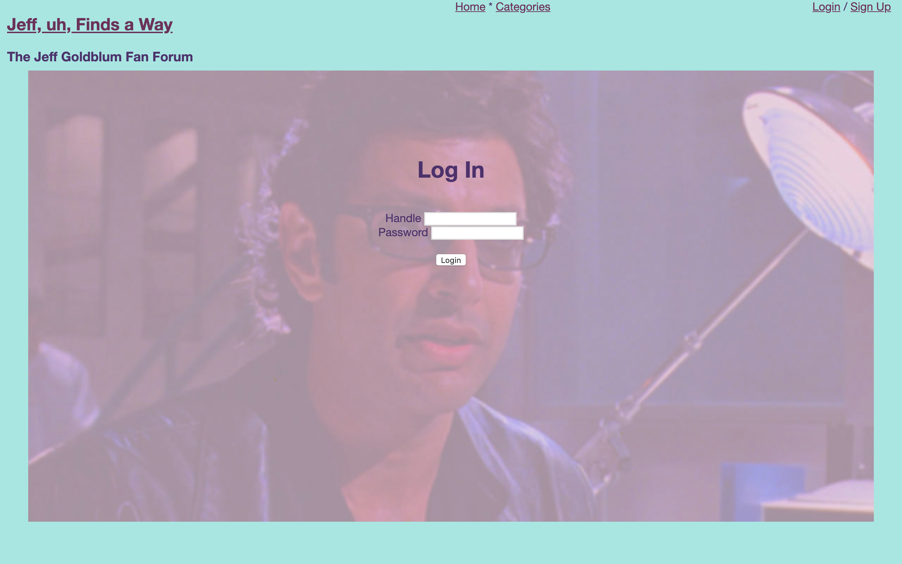

Jeff, uh, Finds a Way is a fan forum for none other than the eccentric, enigmatic Jeff Goldblum. Fan posts can be publically viewed as a chronological thread or browsed by category. Users can create a secure profile to create their own posts and comment on posts by other users. This is a project application done for module 2 of Flatiron School. Additional features, refactors, bug squashes, and enhanced styling are future goals. 

## Authors
  - Dan Romans | [dangrammer](https://github.com/dangrammer)
  - Brett Saxon | [bcsaxon](https://github.com/bcsaxon)

## Ruby Version
  - ruby 2.6.1

## Rails Version
  - rails ~> 6.0.0

## Database
  - postgreSQL

## Gem Dependencies
  - bcrypt ~> 3.1.7

## How To Install and Run

  1. fork (optional) then clone or download this repository to local machine
  2. use text editor and/or terminal to navigate into `jeff-uh-finds-a-way` directory
  3. run `bundle install` (or `bundle i`) in terminal to install necessary dependencies
  4. run `rails db:create` in terminal to create database
  5. run `rails db:migrate` in terminal to initialize database
  6. run `rails db:seed` in terminal to seed database with starter data
  7. run `rails s` in terminal to run server in browser at http://localhost:3000/